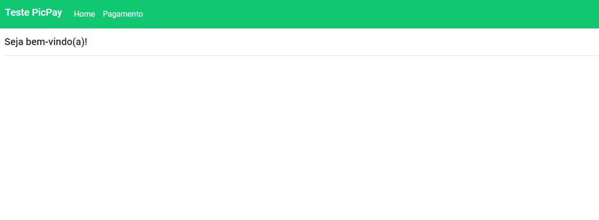
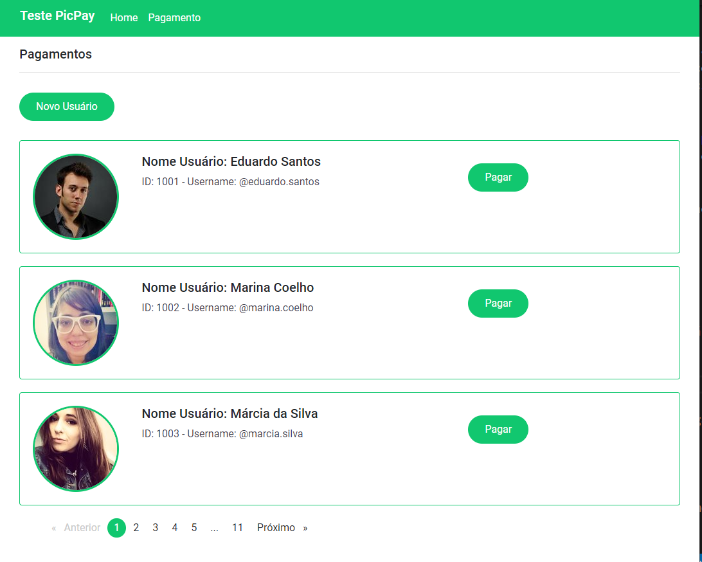
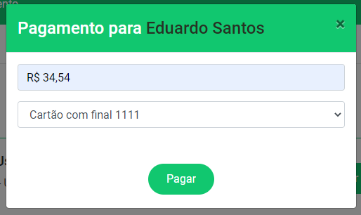
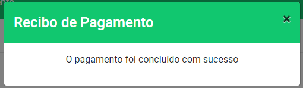
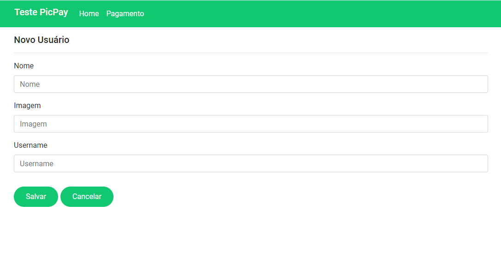

# Desafio Front-end PicPay - Mislene Dalila

Abaixo você encontrará todos as informações necessárias para iniciar o seu teste.

## Setup do projeto

- Angular CLI: 8.3.18
- Node: 10.15.3
- Angular: 8.2.14

## Informações sobre o projeto

- O projeto apresenta uma plataforma que apresenta umas lista de usuários, possibilitando realizar pagamentos para os usuários selecionados;
- Para obter a mensagem de "Pagamento realizado com sucesso", selecione o pagamento com o cartão final : "1111";

## Como Executar o projeto?

- Clone o projeto do git, como o comando `git clone <urldoProjeto>`
- Instale as dependências usando o comando `npm install`
- Na raiz do repositório, rode este comando `ng serve` para iniciar o servidor de desenvolvimento.
- A Aplicação estará disponível na porta `http://localhost:4200/`

## Como Executar os teste E2E?

- Para executar os testes, execute o comando `ng e2e`.

## Fluxo das telas

- Na primeira tela é apresenta uma mensagem de Seja bem-vindo(a). Objetivo futuro desta tela é apresentar uma dashboard que apresente gráficos com a quantidade de pagamentos realizados. Essa dashboard será dinâmica, para adicionar parâmetros por períodos.

- Na tela pagamento, são apresentados a lista de usuários que podem receber pagamentos, com a ação de "Pagar", que possibilita enviar uma quantia para o usuário selecionado.

- Ainda na tela de pagamento é possível acessar a função de cadastrar novos Usuários na Plataforma.

## Screenshots

### Dashboard

### Lista de Usuários

### Modal de pagamento

### Modal de pagamento concluído com sucesso

### Novo Usuário

#

Agradeço a oportunidade :green_heart:
